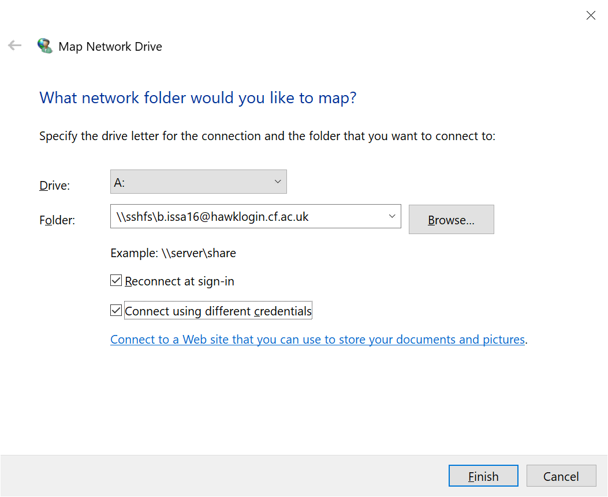
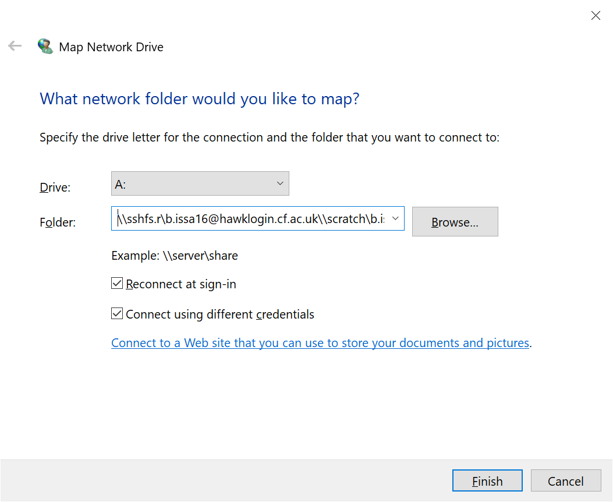

## Map SCW network drives


- [Windows](#windows)
- [MacOS and Linux](#macos-and-linux)

---

### Windows

---

- Install the latest stable version of [WinFSP](https://github.com/billziss-gh/winfsp/releases/latest)

- Install the latest stable version of [SSHFS-Win](https://github.com/billziss-gh/sshfs-win/releases/latest)

- To map your SCW **home** directory

  - Open File Explorer, right-click on **This PC** and choose **Map network drive**. Choose a drive to mount at and in the Folder field enter: 

    ```
    \\sshfs\b.username@hawklogin.cf.ac.uk
    ```

    

- To map your SCW **scratch** directory

  - Open File Explorer, right-click on **This PC** and choose **Map network drive**. Choose a drive to mount at and in the Folder field enter:  

    ```
     \\sshfs.r\b.username@hawklogin.cf.ac.uk\\scratch\b.username
    ```

    


---

### MacOS and Linux

---

- TODO

