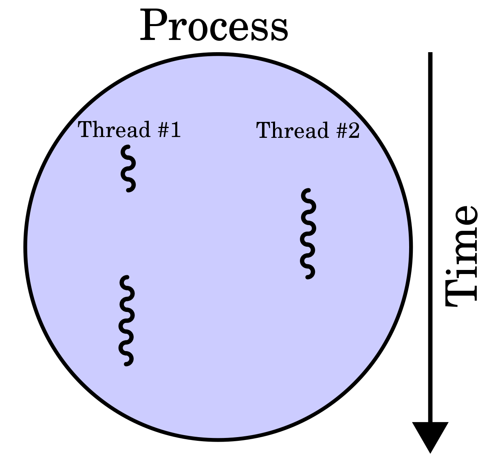
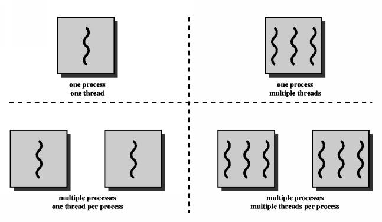
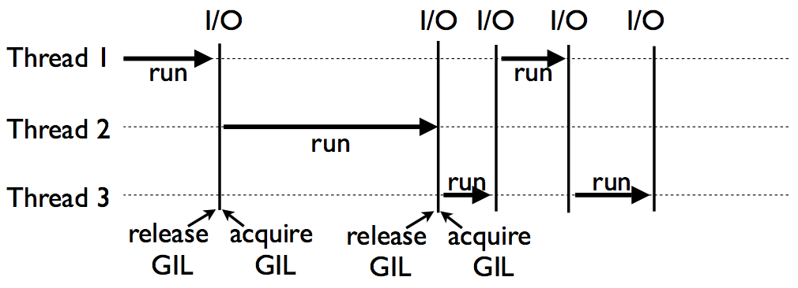
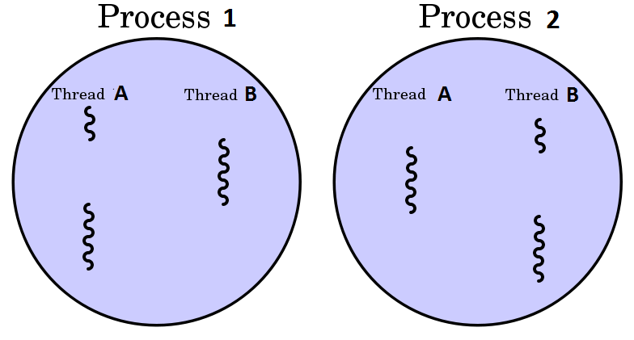

# Research Computing Community

- Background

  - High-Performance Computing Wales / SuperComputing Wales
  
  - Research Software Engineers

- Future
  
  - Collate expert knowledge into an open and shared centralised repository
  
  - Workshops
  
  - Projects 
  
  - Acknowledgements

---

# Workshops

- Introduction to the Linux Shell
  - *Monday 18 November 2019, 09:00–12:00*

- Version Control Using Git
  - *Tuesday 19 November 2019, 09:00–12:00*

- Programming Principles and Practice using Python
  - *Monday 2 December 2019, 09:30–16:30*

- Advanced Python
  - *Tuesday 3 December 2019, 09:30–16:30*

- **Parallel Processing in Python** 
  - *Wednesday 4 December 2019, 09:30–16:30*

- Requests?

---

# Overview

- What are processes and threads?

- What is parallel processing?

- Multiprocessing vs Multithreading.

- CPU vs Core.
  
- Determine available resources.

- Python's GIL problem.

- Multiprocessing examples.

- Using the Supercomputing Wales cluster. 

- Desktop to cluster.

- GNU Parallel.

---

# What are processes and threads?

- A **process** is an instance of a running program.

- Processes create **threads** (sub-processes) to handle sub-tasks.

- **Threads** live and operate inside a **process**.

.center[
  
]
.center[
  **Note**: Running on a single processor.
]

---

# Application example

- When you open a text editor, you create a **process**. 

- When you start typing, the process creates (spawns) **threads**.

  - One to read keystrokes
  - One to display text
  - One to autosave your file
  - One to highlight spelling mistakes
  

- By creating multiple threads, the text editor takes advantage of idle CPU time (waiting for keystrokes or files to load) and makes you more productive.

- **Diagram**

---

# Multithreading vs Multiprocessing

- **Multithreading** - Single processes, multiple threads

- **Multiprocessing** - Multiple processes

- **Multithreading** and **Multiprocessing** - Mulitple processes and multiple threads

.center[
  
]

- We will just focus on **multiprocessing** (multiple processes, one thread per process)

---

# CPU vs Core

- The CPU, or processor, manages the fundamental computation work of the computer (processes).

- **CPUs** have one or more **cores**, allowing the CPU to execute code simultaneously.

.center[
   
]

- SCW
  - 40 core node - 2 CPU with 20 cores each
  - 64 core node - 2 CPU with 32 cores each 
---

# Python's GIL problem

- Python has something called the GIL (Global Interpreter Lock).

- It prevents two threads from executing simultaneously in the same process.

- Libraries like Numpy bypass this limitation by running external code in C.

- The most popular solution is to use **multiprocessing**.

- Python provides a library to simplify multiprocessing.

- Python processes get their own Python interpreter and memory space so the GIL won’t be a problem.

---

# Python's GIL problem

.center[
  
]

---

# Multiple processes

.center[
  
]

---

# When to use threads and processes?

- **Processes** speed up Python operations that are CPU intensive because they benefit from multiple cores and avoid the GIL problem.

- **Threads** are best for I/O tasks or tasks involving external systems because threads can work more efficiently together (lower overhead).

- **Threads** provide no benefit in Python for CPU intensive tasks because of the GIL problem.

---

# When to use threads and processes?

- If your code has a lot of I/O or Network usage

  - Multithreading is your best bet because of its low overhead

- If you have a graphical user interface application

  - Multithreading so your UI thread doesn't get locked up

- If your code is CPU heavy (bound)
  
  - You should use multiprocessing (if your machine has multiple cores)

---

# What is parallel processing?

- Parallel processing is a mode of operation where a task (program) is executed simultaneously in multiple processes in the same computer.

- It is meant to reduce the overall processing time.

- Python provides a built in module to run independent parallel processes.

- It enables users to use multiple processors on a machine.

- **Diagram**

---

# Determine available resources

- Firstly, we need to determine what resources are available to our program.

- The maximum number of processes you can run at a time is limited by the number of processors in your computer.

- We can use python to determine the number of processors.

- Enables us to avoid assumptions about the number of processors.

```py
import multiprocessing as mp

print(f'Number of processors: {mp.cpu_count()}')

> Number of processes: 4
```

- On the SCW cluster, we have access to a few more than 4 processors.

---

# Multiprocessing

- Let's treat the available cores as a pool of resources - *workers* (diagram).

- Generate a list of items to be worked on.

- Each item in the list will be processed by *worker* core in the pool of resources.

- The multiprocessing pool can be used for parallel execution of a function across multiple input values.

- Distributing the input data across processes (data parallelism).

- Example: Distributing work to each individual in the workshop.

---

# Multiprocessing Pool

```py
import multiprocessing as mp

def my_func(x):
  print(x*x)

num_cores=mp.cpu_count()

pool = mp.Pool(num_cores)

pool.map(my_func, [4,2,3])
```

---

# Multiprocessing Pool

```py
import multiprocessing as mp

def my_func(x):
  return(x*x)

num_cores=mp.cpu_count()

pool=mp.Pool(num_cores)

result=pool.map(my_func, [4,2,3])
print(result)
```


---
# Multiprocessing Pool

```py
import multiprocessing as mp

work_items=["Aaron", "Beth", "George", "Mia"]

def worker_func(work_item):
  print(f'Process {work_item}')

num_cores=mp.cpu_count()
print(f'Python has found {num_cores} cores')

work_pool=mp.Pool(num_cores)
work_pool.map(worker_func, work_items)
```
---

# Multiprocessing Pool with process id

- Is Aaron telling the truth?

```py
import multiprocessing as mp

# This could be a list of any Python datatype (lists, functions, dicts)
work_items=["Aaron", "Beth", "George", "Mia"]

def worker_func(work_item):
  process_id=mp.current_process()
  print(f'Process {work_item} on process {process_id}')

num_cores=mp.cpu_count()
print(f'Python has found {num_cores} cores')

work_pool=mp.Pool(num_cores)
work_pool.map(worker_func, work_items) # map_async

print('done')
```
---

# Launch multiple python programs

- We can use **Pool.map()** to run multiple python scripts in parallel.

```py
import os
import multiprocessing as mp

# List of scripts or args to program?
scripts = ['script_1.py', 'script_2.py', 'script_3.py']

def run_python_script(script):
  os.system(f'python {script}')  # args?

num_cores=mp.cpu_count()
print(f'Python has found {num_cores} cores')

pool= mp.Pool(processes=num_cores)
pool.map(run_python_script, scripts)
```

---

# map vs imap

- A more optimised method is `imap`.

- This method does not duplicate the memory space of the original Python process to different workers.

 - The outcome of using `imap` is identical to `map`, but reduces memory usage.
 
- One thing to note is that `imap` and `map` can only pass one parameter to the function to be parallelised.

- We can pass more than one arguement using `starmap`.

---

# starmap

```py
import multiprocessing as mp

def worker_func(a,b,c,d):
  process_id=mp.current_process()
  print(f'Process {a} {b} {c} {d} on process {process_id}')

num_cores=mp.cpu_count()
print(f'Python has found {num_cores} cores')

work_pool=mp.Pool(num_cores)
work_pool.starmap(worker_func, [
  (1,2,3,4),  # process 1
  (5,6,7,8),  # process 2
])
# starmap_async

print('done')
```
---

# What is Synchronous and Asynchronous execution?

- In parallel processing, there are two types of execution: 
  
  - **Synchronous** and **Asynchronous**.

- **Synchronous** execution is where the processes are completed in the same order in which they were started.

- **Asynchronous** execution is where the processes may not be completed in the same order in which they were started. However, it may process the items quicker.

---

# Synchronous and Asynchronous

- There are two main classes in the multiprocessing module to implement parallel execution: The **Pool** Class and the **Process** Class.

- The general way to parallelise any operation is to take a particular function that should run multiple times and make it run in parallel on different processors.

---

# Pool and apply

- The **Pool** class provides `apply()`, `map()` and `starmap()` methods to make any function run in parallel.

- Both `apply()` and `map()` take the function to be parallelised as the main argument.

- The difference is that `apply()` lets you pass an `args` argument that is passed to the function.

- Use `map()` for simple operations.

- Use `apply()` for more complex operations.

---

# Serial I/0 heavy task

- Let's write 100,000 lines to a file and time it.

```py
import time

def io_heavy(n):
    t0 = time.time()
    
    f = open('output.txt', 'w')
    for i in range(n):
      f.write('Some repeated text\n')
    f.close()
    
    t1 = time.time()
    
    print(f'io_heavy took {t1-t0}')

io_heavy(100000)

```

---

# Parallel I/O heavy task

- Can we use the **Pool** class to parallelise the function?

```py
import multiprocessing as mp

num_cores=mp.cpu_count()
print(f'Python has found {num_cores} cores')

def io_heavy(num_lines, file_idx):
    f = open(f'output_{file_idx}.txt', 'w')
    for i in range(num_lines):
      f.write('Some repeated text\n')
    f.close()
    process_id=mp.current_process()
    print(f'io_heavy on {process_id}')

work_pool=mp.Pool(num_cores)
work_pool.starmap(io_heavy, [
  (10,1,), # process 1
  (100,2,)  # process 2
])
# starmap_async

print('done')
```
---

# Serial CPU Heavy task

```py
import time

def cpu_heavy(n):

    t0 = time.time()
    
    count = 0
    for i in range(n):
        count += i
        
    t1 = time.time()
    
    print(f'cpu_heavy took {t1-t0}')
        
cpu_heavy(1000000)

```

---

# Parallel CPU Heavy task

- Can we use the **Pool** class to parallelise the function?


```py
import multiprocessing as mp

num_cores=mp.cpu_count()
print(f'Python has found {num_cores} cores')

def cpu_heavy(n):
    count = 0
    for i in range(n):
        count += i
    process_id=mp.current_process()
    print(f'cpu_heavy on process {process_id}')

work_pool=mp.Pool(num_cores)
work_pool.starmap(cpu_heavy, [
  (100,),   # process 1
  (1000,),  # process 2
])
# starmap_async

print('done')
```
---

# Numpy

```py
import numpy as np
import pandas as pd
import multiprocessing as mp

df = pd.DataFrame(np.random.randint(3, 10, size=[5, 2]))
print(df.head())
```

---

# Row wise Operation

```py
def hypotenuse(row):
  return round(row[1]**2 + row[2]**2, 2)**0.5

with mp.Pool(4) as pool:
  result = pool.imap(hypotenuse, df.itertuples(name=False), chunksize=10)
  output = [round(x, 2) for x in result]

print(output)

> [9.43, 5.83, 5.0, 5.66, 11.4] 
```

---

# Column wise Operation

```py
def sum_of_squares(column):
  return sum([i**2 for i in column[1]])

with mp.Pool(2) as pool:
  result = pool.imap(sum_of_squares, df.iteritems(), chunksize=10)
  output = [x for x in result]

print(output)

```

---

# SuperComputing Wales

- Login

- Modules

- Python Shell

- Queue

- Home / Scratch

- Requesting resources

- GNU parallel
  - Store a file of commands - Automatic management of resource pool

---

# Multiprocessing slurm script

```sh
#!/usr/bin/env bash

#SBATCH --job-name=parallel

#SBATCH --output=%J.out
#SBATCH --error=%J.err

#SBATCH --nodes=1
#SBATCH --ntasks=1
#SBATCH --cpus-per-task=40

#SBATCH --account=scw1124

#SBATCH --partition=htc

#SBATCH --time=00-03:00

module purge

module load python/3.7.0

python3 filename.py # filename.py contains the logic for multiprocessing
```

---

# GNU Parallel slurm script

```sh
#!/usr/bin/env bash

#SBATCH --job-name=parallel

#SBATCH --output=%J.out
#SBATCH --error=%J.err

#SBATCH --nodes=1
#SBATCH --ntasks=1
#SBATCH --cpus-per-task=4

#SBATCH --account=scw1124

#SBATCH --partition=htc

#SBATCH --time=00-03:00

module purge

module load python/3.7.0
module load parallel

echo "Start!"
time parallel < commands.txt
echo "Finished!"
```

---

# commands.txt

```txt
python3 -c "print('Hello from line 1')"
python3 -c "print('Hello from line 2')"
python3 -c "print('Hello from line 3')"
python3 -c "print('Hello from line 4')"
```